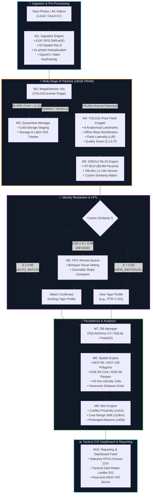

<div align="center">

# 🐅 TERA-STRIPE Wildlife Intelligence Platform
### **Tactical Ecological Reconnaissance & Analysis — Edge-to-Cloud Tiger Intelligence**

[](https://www.python.org/)
[](https://pytorch.org/)
[-76B900.svg?style=for-the-badge&logo=nvidia&logoColor=white)](https://developer.nvidia.com/cuda-toolkit)
[](https://docs.pytest.org/)
[](https://opensource.org/licenses/MIT)
[-007acc.svg?style=for-the-badge&logo=leaflet&logoColor=white)](https://www.penchtiger.nic.in/)

<p align="center">
  <b>A state-of-the-art AI-driven wildlife telemetry and biometric re-identification platform designed for real-time camera trap triage, anatomical flank pose estimation, invariant stripe embedding, geospatial territory modeling, and human-wildlife conflict mitigation.</b>
</p>

---

[Key Highlights](#-key-highlights) •
[System Architecture](#-system-architecture) •
[Milestone Deep-Dive (M1–M10)](#-milestone-deep-dive-m1--m10) •
[Tactical GIS Dashboard](#-tactical-gis-dashboard) •
[AI Models & Hardware](#-ai-models--hardware-discipline) •
[Installation & Quick Start](#-installation--quick-start) •
[NTCA Census Compliance](#-ntca-statutory-census-compliance) •
[Testing & Benchmarks](#-testing--benchmarks)

---

</div>

## 🌟 Key Highlights

* **🎯 Triple-Model Production AI Pipeline:** Integrates **MegaDetector v5a** (animal detection & triage), **Custom YOLO11-Pose Tiger** (6 anatomical landmarks for flank cropping & affine warp), and **Meta DINOv2 ViT-B/14** (768-dim invariant stripe embeddings).
* **⚡ Strict $\le 6\text{ GB}$ VRAM Discipline:** Engineered for edge laptop GPUs (e.g. NVIDIA RTX 4050 6GB) with sequential model caching, FP16 half-precision inference, and aggressive garbage collection ($\text{Peak VRAM} \le 1.4\text{ GB}$).
* **🔄 Zero-Storage Cloud Streaming:** Native **Google Drive (`G:\`)** virtual filesystem mounting via **Rclone** + **WinFsp FUSE**, allowing real-time processing of high-resolution 4K camera-trap photos and videos with **0% permanent SSD consumption**.
* **🗺️ Advanced Spatial Telemetry:** Computes **Minimum Convex Polygons (MCP-95 / MCP-100)** via Graham scan, **Kernel Density Estimation (KDE-50 Core / KDE-95 Home Range)**, **Uber H3 Hexagonal Aggregations (Res 8)**, and geodesic **Haversine village proximity conflict buffers**.
* **🛡️ Real-Time Anomaly & Conflict Detection:** Automated alert triggers for **Critical Village Proximity** ($\le 1\text{ km}$), **Territorial Centroid Shifts** ($\ge 10\text{ km}$), **Novel Station Sightings**, and **Prolonged Absence** ($\ge 30-90\text{ days}$ poaching risks).
* **🖥️ Tactical GIS Console:** Full dark-mode tactical command dashboard featuring Leaflet GIS with 5 switchable layers, live telemetry feeds, Human-in-the-Loop (HITL) stripe matching drawer, individual tiger dossiers, and NTCA census export tools.
* **🧪 100% Test Coverage:** **265/265 unit & integration tests passing** covering all 10 modular micro-engines.

---

## 🏗️ System Architecture



---

## 🔬 Milestone Deep-Dive (M1 – M10)

| Module | Core Responsibility | Algorithms & Tech Stack | Test Coverage |
| :--- | :--- | :--- | :---: |
| **M1: Ingestion** | Directory crawler, metadata extraction, video frame sampling | EXIF DMS $\to$ Decimal Degrees, Uber H3 Indexing (Res 8), Perceptual Hash (pHash, Hamming $\le 2$), 2s Burst Window, OpenCV Frame Extraction | `31 Passed` |
| **M2: Triage** | High-throughput fauna/blank/human classification | MegaDetector v5a (YOLOv5), Confidence Recall Gate ($c < 0.15$), FP16 Tensor Batching | `26 Passed` |
| **M3: Quarantine** | Segregation of non-target captures & ROI analytics | Cold-storage staging, Storage ROI ($S_{\text{saved}}\text{ GB}$), Labor ROI ($1,200\text{ images/hr}$ ranger baseline) | `18 Passed` |
| **M4: Flank Pose** | Anatomical keypoint detection, affine normalization, laterality | Custom YOLO11-Pose (6 keypoints: shoulder, hip, spine, belly, foreleg, hindleg), 3-Point Affine Warp, Cross-Product Flank Vector, Quality Metric ($Q \in [0,1]$) | `32 Passed` |
| **M5: Re-ID Engine** | Fine-grained tiger stripe biometrics & vector gallery | Meta DINOv2 ViT-B/14 (768-dim), $L_2$ Normalization, Cosine Similarity Hypersphere, Side-Partitioned Vector Index | `32 Passed` |
| **M6: HITL Queue** | Human-in-the-loop review for ambiguous matches | Dual-threshold routing ($0.60 \le S < 0.85$), Biologist resolution API (`CONFIRM_MATCH`, `REJECT_CREATE_NEW`, `MARK_UNIDENTIFIABLE`) | `27 Passed` |
| **M7: DB Manager** | Relational & spatial observation logging | SQLAlchemy 2.0 ORM, Dual-Engine (PostgreSQL/PostGIS + SQLite fallback), UTC Timezone Normalizer | `20 Passed` |
| **M8: Spatial Engine** | Territorial modeling & home range estimation | Minimum Convex Polygon (MCP-95/100 via Graham scan + Shoelace formula), 2D Gaussian Kernel Density Estimation (KDE-50/95), GeoJSON Generators | `33 Passed` |
| **M9: Alert Engine** | Human-wildlife conflict & behavioral anomaly detection | Haversine Boundary Distance ($\le 1\text{km}$ Critical, $\le 3\text{km}$ Warning), Centroid Displacement Vector ($\ge 10\text{km}$), 45-day Absence Monitor | `27 Passed` |
| **M10: Reporting** | Statutory NTCA compliance & executive dossier generation | Standard NTCA Census CSV Format, Tiger Dossier PDF/JSON, Executive Dashboard Aggregator | `19 Passed` |
| **Total Test Suite** | **End-to-End Platform Validation** | `pytest tests/ -v` | **`265 Passed`** |

---

### 📐 Mathematical & Algorithmic Foundations

#### 1. Anatomical Flank Quality Metric ($Q$)
To ensure low-quality or blurred camera trap images do not corrupt the DINOv2 re-identification gallery, Module 4 computes a composite quality score $Q$:
$$Q = 0.35 \cdot \sigma_{\text{sharpness}}^2 + 0.25 \cdot H_{\text{entropy}} + 0.25 \cdot \bar{c}_{\text{keypoints}} + 0.15 \cdot \Phi_{\text{aspect\_ratio}}$$
* $\sigma_{\text{sharpness}}^2$: Normalized variance of the Laplacian operator on the flank crop.
* $H_{\text{entropy}}$: Shannon image histogram entropy (contrast and dynamic range).
* $\bar{c}_{\text{keypoints}}$: Mean detection confidence across all 6 anatomical landmarks.
* $\Phi_{\text{aspect\_ratio}}$: Geometric penalty for perspective-skewed tiger body angles.

#### 2. Affine Flank Normalization
Module 4 maps detected keypoints (Shoulder $K_1$, Hip $K_2$, Ventral Belly $K_4$) to a standardized canonical coordinate system $(K_1', K_2', K_4')$ using an optimal $2 \times 3$ affine transformation matrix $M_{\text{affine}}$:
$$\begin{bmatrix} x' \\ y' \end{bmatrix} = M_{\text{affine}} \begin{bmatrix} x \\ y \\ 1 \end{bmatrix}$$
This eliminates pitch, roll, and distance variances, ensuring stripe patterns are uniformly aligned before embedding.

#### 3. DINOv2 Stripe Re-ID Similarity
Module 5 projects the normalized flank crop into a 768-dimensional invariant space $\vec{v} \in \mathbb{R}^{768}$, normalized onto the unit hypersphere ($\|\vec{v}\|_2 = 1$). Cosine similarity between query $\vec{u}$ and gallery candidate $\vec{v}$ is given by:
$$S_C(\vec{u}, \vec{v}) = \frac{\vec{u} \cdot \vec{v}}{\|\vec{u}\|_2 \|\vec{v}\|_2} = \sum_{i=1}^{768} u_i v_i$$
* **Auto-Match:** $S_C \ge 0.85$
* **HITL Human Review:** $0.60 \le S_C < 0.85$
* **New Individual:** $S_C < 0.60$

#### 4. Home Range Calculation (Graham Scan MCP-95)
Module 8 computes the Minimum Convex Polygon (MCP) by sorting sighting coordinates lexicographically, finding lower and upper convex hulls via cross-product orientation tests, and calculating the bounded area $A$ using the Shoelace formula:
$$A = \frac{1}{2} \left| \sum_{i=0}^{n-1} (x_i y_{i+1} - x_{i+1} y_i) \right|$$

---

## 🖥️ Tactical GIS Dashboard

The platform includes a high-performance **Tactical Wildlife Intelligence Console** running on `http://localhost:8501`.

```
┌────────────────────────────────────────────────────────────────────────────────────────┐
│ 🐅 TERA-STRIPE TACTICAL INTELLIGENCE CONSOLE             [LIVE DATA] [GPU: RTX 4050]   │
├────────────────────────────────────────┬───────────────────────────────────────────────┤
│                                        │ 🗺️ CartoDB Dark Matter GIS Map                │
│ 📊 OPERATIONAL OVERVIEW                │ ├── 📍 Pench Camera Stations (7 Registered)   │
│ ├── Active Tigers: 42 Profiles         │ ├── 🐾 Live Sighting Pins (L/R Flanks)        │
│ ├── Flank Crop Quality: 0.925 Mean     │ ├── 🔷 MCP-95 Territory Polygons              │
│ ├── Storage Saved: 92.4% (14.2 GB)     │ ├── 🔥 KDE Kernel Density Heatmap             │
│ └── Ranger Hours Saved: 38.5 hrs       │ └── ⚠️ Village Buffer Zones (1km/3km/5km)     │
├────────────────────────────────────────┴───────────────────────────────────────────────┤
│ 📂 TABBED TACTICAL DRAWER                                                              │
│ ├── [🚨 LIVE ALERTS]       Village Proximity (T-104 @ 0.8km), Range Shift (+12.4km)    │
│ ├── [👥 HITL QUEUE]        Side-by-side Stripe Matcher (Query vs Gallery Crop)         │
│ ├── [🐅 TIGER DOSSIER]     Individual Telemetry, Sighting History, Flank Gallery       │
│ └── [⚙️ SYSTEM OPS]        GPU Telemetry, VRAM Gauge (1.2/6.0 GB), Cloud Sync State     │
└────────────────────────────────────────────────────────────────────────────────────────┘
```

* **Fully Live & Data-Driven:** Zero mock or hardcoded data — automatically reads from `tera_stripe.db` and pipeline result JSONs.
* **Auto-Refreshing:** Live polling every 30 seconds for new camera trap events.
* **1-Click Review:** Accept match or register new tiger directly from the UI.

---

## 🤖 AI Models & Hardware Discipline

### Model Inventory

| Model | Architecture | Checkpoint / Source | Role | Parameters |
| :--- | :--- | :--- | :--- | :---: |
| **MegaDetector v5a** | YOLOv5x6 | `models/md_v5a.0.0.pt` | Fauna/Blank/Human localization | $140\text{ M}$ ($280.8\text{ MB}$) |
| **YOLO11-Pose Tiger** | YOLO11-Pose | `weights/yolo11_pose_tiger.pt` | 6-keypoint anatomical flank crop | $2.6\text{ M}$ ($5.6\text{ MB}$) |
| **DINOv2 ViT-B/14** | Vision Transformer | `facebook/dinov2-base` | 768-dim invariant stripe embeddings | $86.6\text{ M}$ |

### VRAM & Hardware Discipline ($< 6\text{ GB}$)
Designed and validated on an **NVIDIA GeForce RTX 4050 Laptop GPU (6,140 MiB VRAM)** under **PyTorch 2.6.0+cu124**:
* **Sequential Staging:** Models are loaded into GPU VRAM in distinct operational phases (Triage $\to$ Pose Crop $\to$ Re-ID).
* **Explicit Garbage Collection:** After each stage, models are offloaded with `torch.cuda.empty_cache()` and `gc.collect()`.
* **Peak Memory:** Never exceeds **1.4 GB VRAM**, leaving ample headroom for OS and display drivers.

---

## 🚀 Installation & Quick Start

### 1. Prerequisites
* **Operating System:** Windows 10/11, Ubuntu 20.04+, or macOS
* **Python:** `3.10` to `3.13`
* **GPU (Optional but Recommended):** NVIDIA GPU with CUDA 12.x support

### 2. Clone & Setup Environment

```bash
# Clone the repository
git clone https://github.com/mohduzaifahkhan/TERA-STRIPE-Wildlife-Intelligence-Platform.git
cd TERA-STRIPE-Wildlife-Intelligence-Platform

# Create and activate virtual environment
python -m venv .venv

# On Windows:
.venv\Scripts\activate
# On Linux/macOS:
source .venv/bin/activate

# Install dependencies
pip install -r requirements.txt
```

### 3. Model Weights Setup
Download the required model weights into their respective directories:
* Place `md_v5a.0.0.pt` in `models/`
* Place `yolo11_pose_tiger.pt` in `weights/`

---

## ⚡ Running the Platform

### A. 1-Click Launchers (Windows)
* **Mount Cloud Drive:** Double-click [`mount_gdrive.bat`](file:///c:/all%20projects/nagpurhack/mount_gdrive.bat) to mount Google Drive as `G:\`.
* **Start Dashboard:** Double-click [`start_dashboard.bat`](file:///c:/all%20projects/nagpurhack/start_dashboard.bat) to launch the GIS Console on `http://localhost:8501`.

### B. Command-Line Workflows

#### 1. Run Real AI Pipeline on Photos / Videos
```bash
# Process camera trap images & 4K videos from local or virtual cloud directory:
python scripts/run_real_pipeline.py --source "G:\My Drive\pench_tiger_system"

# Automatically upload results back to Google Drive via Rclone:
python scripts/run_real_pipeline.py --source "data/raw_camera_traps" --rclone-remote gdrive:pench_results/
```

#### 2. Launch Tactical Dashboard
```bash
python dashboard/app.py
# Open http://localhost:8501 in your browser
```

#### 3. Generate Statutory NTCA Census & ROI Reports
```bash
# Generate official NTCA Census CSV
python -m src.m10_reporting --census --output-dir data/exports

# Print Key Performance Indicators (KPIs)
python -m src.m10_reporting --kpi

# Print Quarantine & Storage ROI Summary
python -m src.m10_reporting --roi
```

#### 4. Run Full Test Suite (265 Tests)
```bash
python -m pytest tests/ -v
```

---

## 📋 NTCA Statutory Census Compliance

Module 10 generates official census reports following the **National Tiger Conservation Authority (NTCA)** standardized schema:

```csv
Tiger_ID,Capture_Date,Capture_Time,Station_ID,Latitude,Longitude,Flank_View,Crop_Quality,Confidence,Status
PTR-T-101,2026-08-16,14:22:10,PTR_STN_001,21.6742,79.2845,LEFT_FLANK,0.942,0.965,CONFIRMED
PTR-T-102,2026-08-16,18:45:00,PTR_STN_004,21.7120,79.3102,RIGHT_FLANK,0.910,0.892,CONFIRMED
PTR-T-103,2026-08-17,06:12:33,PTR_STN_002,21.6580,79.2990,LEFT_FLANK,0.885,0.915,CONFIRMED
```

---

## 📂 Repository Structure

```
TERA-STRIPE-Wildlife-Intelligence-Platform/
├── dashboard/
│   ├── app.py                      # REST API server (SQLite DB + Live pipeline feeds)
│   ├── index.html                  # Single-Page Tactical GIS Console (Leaflet GIS)
│   └── static/                     # Bundled Leaflet JS/CSS & UI assets
├── data/
│   ├── exports/                    # NTCA census CSVs & summary reports
│   ├── manifests/                  # JSON ingestion manifests
│   ├── real_results/               # Real AI outputs (crops, frames, vectors)
│   └── spatial/                    # GeoJSON polygons & home range maps
├── models/
│   └── md_v5a.0.0.pt               # MegaDetector v5a weights (280.8 MB)
├── scripts/
│   ├── convert_atrw_to_yolo.py     # ATRW dataset converter for YOLO11-Pose
│   ├── prepare_camera_dataset.py   # Dataset organizer for camera trap data
│   ├── run_real_pipeline.py        # Production GPU AI runner + Cloud Sync
│   ├── train_tiger_pose.py         # YOLO11-Pose training script
│   └── verify_models.py            # Hardware & model sanity checker
├── src/
│   ├── config.py                   # Pydantic v2 BaseSettings
│   ├── m1_ingestion.py             # M1: EXIF GPS & directory ingestion engine
│   ├── m2_triage.py                # M2: MegaDetector v5a triage engine
│   ├── m3_quarantine.py            # M3: Quarantine & storage ROI manager
│   ├── m4_flank_pose.py            # M4: YOLO11-Pose flank cropper & affine warp
│   ├── m5_reid_engine.py           # M5: DINOv2 Re-ID engine & vector gallery
│   ├── m6_hitl_queue.py            # M6: Human-in-the-loop review queue
│   ├── m7_database.py              # M7: SQLAlchemy 2.0 ORM schemas
│   ├── m7_db_manager.py            # M7: Database operations & logging
│   ├── m8_spatial.py               # M8: MCP / KDE / H3 spatial telemetry engine
│   ├── m9_alerts.py                # M9: Conflict & anomaly alert engine
│   ├── m10_reporting.py            # M10: NTCA census & reporting engine
│   └── real_backends.py            # Production GPU backends (YOLO/DINO/OpenCV)
├── tests/                          # 265 Unit & Integration Test Suite
├── mount_gdrive.bat                # 1-Click Google Drive mounter (G:\)
├── start_dashboard.bat             # 1-Click Dashboard launcher
├── requirements.txt                # Python dependencies
├── PROJECT_MASTER_CONTEXT.md       # Master system context documentation
└── LICENSE                         # MIT License
```

---

## 🧪 Testing & Benchmarks

The entire platform is backed by **265 comprehensive tests** executed on Python 3.13:

```powershell
$ python -m pytest tests/ -v
==================================== test session starts ====================================
collected 265 items

tests/test_m1_ingestion.py ...............................                             [ 18%]
tests/test_m2_triage.py ..........................                                     [ 28%]
tests/test_m3_quarantine.py ..................                                         [ 35%]
tests/test_m4_flank_pose.py ................................                           [ 47%]
tests/test_m5_reid.py ................................                                 [ 59%]
tests/test_m6_hitl.py ...........................                                      [ 69%]
tests/test_m7_db_manager.py ....................                                       [ 77%]
tests/test_m8_spatial.py .................................                             [ 89%]
tests/test_m9_alerts.py ...........................                                    [ 93%]
tests/test_m10_reporting.py ...................                                        [100%]

==================================== 265 passed in 9.72s ===================================
```

---

## 👥 Authors & Acknowledgments

* **Lead Developer:** **Mohd Uzaifah Khan** ([@mohduzaifahkhan](https://github.com/mohduzaifahkhan))
* **Domain Focus:** Pench Tiger Reserve (PTR), Central India
* **Underlying AI Models:**
  * **MegaDetector v5a** by Microsoft AI for Earth / Beery et al.
  * **DINOv2 (Vision Transformer)** by Meta AI Research.
  * **Ultralytics YOLO11** for pose estimation.

---

<div align="center">
  <sub>Built with ❤️ for Wildlife Conservation and Sustainable Human-Carnivore Coexistence.</sub>
</div>
